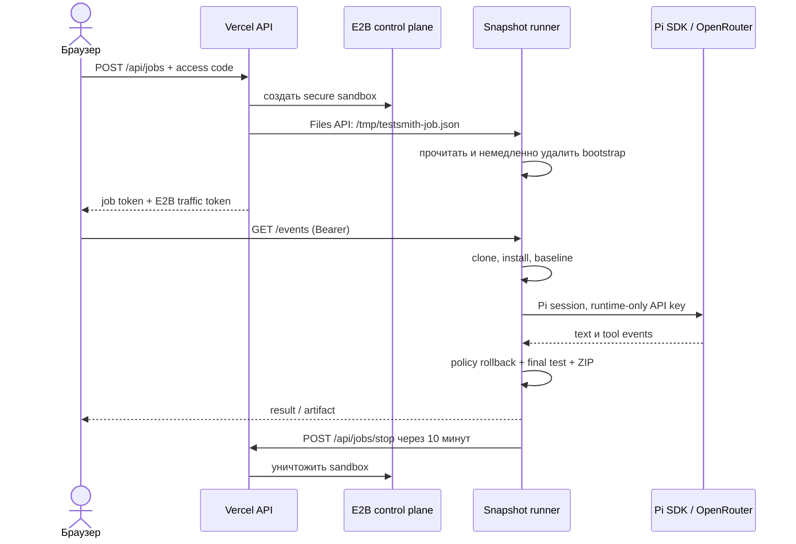

# TestSmith

TestSmith — русскоязычный веб-сервис, который запускает Pi coding agent в одноразовой E2B sandbox, добавляет тесты в публичный JavaScript/TypeScript-репозиторий GitHub и возвращает проверяемые артефакты. Sandbox не делает commit, push или pull request.

## Что получает пользователь

- live-этапы `sandbox → clone → install → baseline → Pi → final test → artifacts`;
- два режима: `tests_only` и `tests_and_fix`;
- независимые baseline/final test logs;
- отчёт, список изменённых и исключённых файлов, patch и ZIP;
- автоматическое уничтожение sandbox через 10 минут после результата.

ZIP содержит:

```text
report.md
result.json
changes.patch
changed-files/
baseline.log
final-tests.log
manifest.json
```

## Архитектура



Подробности и границы доверия описаны в [docs/architecture.md](docs/architecture.md).

## Локальная разработка

Требования: Node.js 22.19+, npm и аккаунты E2B/OpenRouter только для реального smoke-теста.

```bash
npm ci
npm --prefix sandbox ci
npm run check
npm run sandbox:typecheck
npm run sandbox:build-runner
```

Для одной только UI-разработки:

```bash
npm run dev
```

Для локальных Vercel Functions используйте `vercel dev` после заполнения локальных environment variables. Секреты не записывайте в репозиторий; `.env.example` содержит только имена настроек.

## Настройка OpenRouter

Перед сборкой template и production deployment выберите два endpoint для `deepseek/deepseek-v4-flash`:

```bash
OPENROUTER_API_KEY=... npm run providers:check
```

Скрипт оставляет endpoint с tools и контекстом не менее 128K, сортирует их по uptime и цене и печатает значение `OPENROUTER_PROVIDER_ORDER`. Если подходящих endpoint меньше двух, команда завершается ошибкой. Во время Vercel build настроенные endpoint повторно валидируются.

Pi получает routing:

```json
{
  "order": ["provider-a", "provider-b"],
  "only": ["provider-a", "provider-b"],
  "allow_fallbacks": false,
  "require_parameters": true,
  "data_collection": "deny"
}
```

## Сборка E2B template

```bash
npm run sandbox:build
```

Команда сначала bundle'ит runner, затем через E2B TypeScript Template SDK создаёт `testsmith-agent-v1`: Node 22, Git, Corepack, pnpm/yarn и заранее запущенный HTTP runner на порту 8080. Snapshot имеет 2 CPU и 2 ГБ памяти.

## Переменные production

| Переменная | Назначение |
|---|---|
| `E2B_API_KEY` | создание и остановка sandbox |
| `OPENROUTER_API_KEY` | runtime-доступ Pi к модели |
| `ACCESS_CODE` | общий код интерфейса |
| `JOB_TOKEN_SECRET` | HMAC-SHA256 подпись job token |
| `E2B_TEMPLATE` | `testsmith-agent-v1` |
| `APP_ORIGIN` | фиксированный production origin без `/` |
| `MAX_ACTIVE_JOBS` | глобальный лимит, по умолчанию `2` |
| `OPENROUTER_MODEL` | по умолчанию `deepseek/deepseek-v4-flash` |
| `OPENROUTER_PROVIDER_ORDER` | два проверенных provider tag через запятую |

Сгенерируйте отдельный OpenRouter key с расходным лимитом, длинный случайный `ACCESS_CODE` и не менее 32 случайных байт для `JOB_TOKEN_SECRET`.

## Деплой

1. Создайте public GitHub repository и отправьте `main`.
2. Подключите repository к Vercel через Git integration.
3. Добавьте production environment variables.
4. Установите Build Command `npm run vercel-build` и Output Directory `dist` (Vite определяется автоматически).
5. Убедитесь, что `APP_ORIGIN` совпадает с production URL, затем передеплойте.
6. Выполните E2B smoke и Playwright production E2E:

```bash
PLAYWRIGHT_BASE_URL=https://your-production.example npm run test:e2e
```

## Политика безопасности

- только URL `https://github.com/<owner>/<repo>` и default branch;
- shallow clone без tags, submodules и Git LFS, затем удаление `origin`;
- OpenRouter key передаётся Files API, bootstrap удаляется до clone, key загружается в `ModelRuntime` и не попадает в `process.env`;
- project `.pi` extensions, skills, prompts, themes, settings и context files отключены;
- корневой `AGENTS.md` читается максимум до 16 КБ как недоверенный справочный текст;
- UI не получает `thinking_delta`, tool payload очищается и обрезается;
- Markdown проходит `rehype-sanitize`, diff/logs отображаются как текст;
- access code не сохраняется; активный job и два короткоживущих токена хранятся в `sessionStorage`;
- E2B controller создаётся с `secure: true`; custom runner port принимает публичный proxy-трафик, но рабочие endpoints требуют подписанный `Authorization: Bearer`, который не помещается в URL;
- CI выполняет lint, typecheck, tests, build и secret scan.

## Ограничения v1

- только публичные JS/TS GitHub repositories и один default branch;
- npm, pnpm и yarn; Bun-only получает `degraded`;
- нет базы и истории заданий;
- лимит capacity основан на списке активных E2B sandbox;
- test script определяется из корневого `package.json`;
- hard timeout sandbox — 25 минут, рабочее время Pi — 15 минут, артефакты живут 10 минут после результата.

## Лицензия

[MIT](LICENSE)
