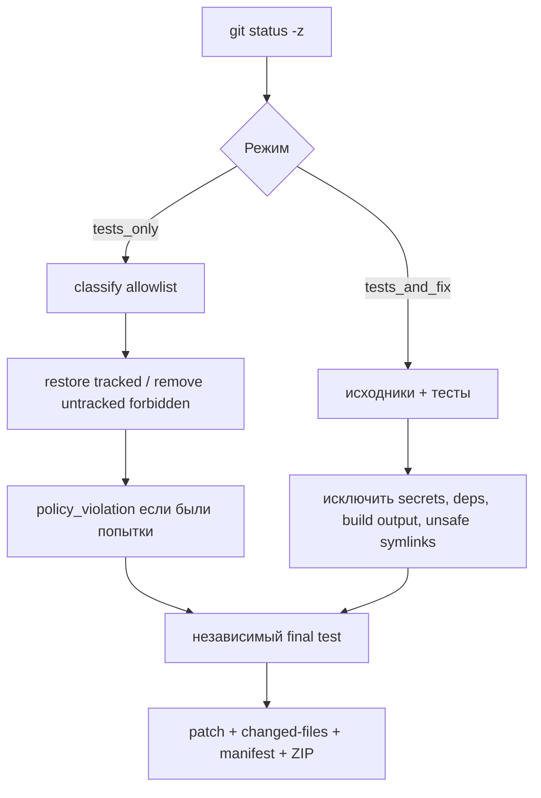

# Архитектура и модель угроз

## Компоненты

| Компонент | Доверенные данные | Ответственность |
|---|---|---|
| React dashboard | краткоживущие job/traffic tokens текущей вкладки | форма, live SSE, безопасный вывод, ZIP |
| Vercel Functions | все production secrets | access code, capacity, sandbox lifecycle, HMAC |
| E2B runner | одна job config в памяти | checkout, Pi, policy, тесты, артефакты |
| Pi SDK | runtime OpenRouter key | автономная работа с разрешёнными coding tools |
| GitHub checkout | ничего доверенного | анализируемый исходный код и ограниченный `AGENTS.md` |

## Жизненный цикл секрета модели

```mermaid
flowchart LR
  A[Vercel secret store] -->|E2B Files API| B[/tmp/testsmith-job.json]
  B -->|read + unlink| C[runner memory]
  C -->|setRuntimeApiKey| D[Pi ModelRuntime]
  D --> E[OpenRouter HTTPS]
  C -. никогда .-> F[process.env / shell]
  C -. никогда .-> G[Git checkout / artifacts / events]
```

Bootstrap-файл имеет owner `user` и существует только между ответом Files API и ближайшим poll runner'а. Runner удаляет файл до сетевого clone. После Pi runtime key удаляется из `ModelRuntime`, строковые ссылки очищаются, временный agent directory удаляется.

## Два токена браузера

Закрытый E2B proxy (`allowPublicTraffic: false`) требует `E2B-Traffic-Access-Token`. Он не заменяет собственную авторизацию TestSmith:

- `E2B-Traffic-Access-Token` пропускает запрос через E2B proxy;
- `Authorization: Bearer <jobToken>` проверяется runner'ом;
- `jobToken` — HMAC payload с `jobId`, `sandboxId`, `exp`, проверяемый также `/api/jobs/stop`;
- ни один токен не помещается в URL или persistent storage.

## Изменения файлов



`changed-files/` не следует за symlink. Удалённые файлы присутствуют только в `changes.patch`. `manifest.json` содержит SHA-256 и размер каждого файла ZIP до самого manifest.

## Лимиты

| Этап | Лимит |
|---|---:|
| clone | 90 секунд |
| исходный checkout | 200 МБ |
| install | 4 минуты |
| workspace после install | 4 ГБ |
| один test run | 3 минуты |
| Pi | 15 минут |
| E2B hard timeout | 25 минут |
| доступность результата | 10 минут |

Baseline failure не останавливает Pi. Официальные test runs запускает и логирует runner. Статус `passed` возможен только после успешного final test, завершённой установки и соблюдения политики.
